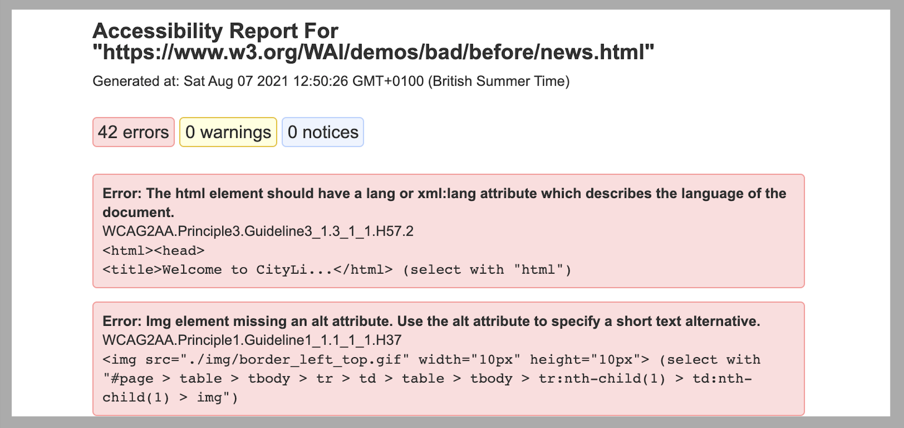

# Pa11y Sample Project

Example project demonstrating accessibility testing using pa11y

Accessibility test will be executed against [The Before and After Demonstration (BAD)](https://www.w3.org/WAI/demos/bad/Overview.html) website from [W3C WAI](https://www.w3.org/WAI/)

## Installation

Navigate to project folder on the command line

    cd demo-pa11y

Install dependencies

    npm install 

## Running the tests

#### pa11y example
Run the following command

    npm run pa11y 

View execution report located at pa11y/reports/pa11y-test-report.html

#### pa11y-ci example
Run the following command

    npm run pa11y-ci

View execution report located at pa11y-ci/reports/index.html

